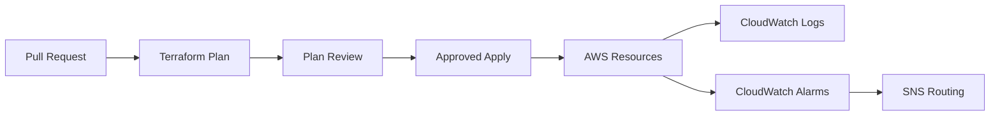

# AWS Infrastructure Platform

Infrastructure as Code standardization for client delivery environments.

Before this work, cloud resources were created manually, with limited reproducibility, weak auditability, and configuration drift across projects. The platform introduced reusable Terraform modules, CI/CD plan review, least-privilege IAM, centralized secrets, scheduled workloads, structured logs, alarms, and billing controls.

**Period:** February 2026  
**Status:** In production  
**Role:** Sole architect and implementer

---

| Dimension | Before | After |
|---|---:|---:|
| Environment setup | 4-8 hours | ~15 minutes |
| Audit trail | Manual/noisy | Git-backed |
| Infrastructure drift | Common | Plan-reviewed |
| Recovery path | Manual | Terraform apply |
| Secrets handling | Fragmented | Centralized |
| Observability | Reactive | CloudWatch/SNS |

---

## Case Study Files

- [Overview](overview.md) — context, problem, and solution approach
- [Architecture](architecture.md) — Terraform module design, AWS resources, CI/CD pipeline
- [Technical Decisions](technical-decisions.md) — Lambda vs EC2, Terraform vs CDK, state management
- [Key Flows](key-flows.md) — deploy flow, onboarding flow, token refresh with distributed lock
- [Representative Snippets](representative-snippets.md) — module structure, circuit breaker, structured logging
- [Reliability and Ops](reliability-and-ops.md) — alarms, MTTR, and incident record
- [Results](results.md) — quantified outcomes

## Stack

Terraform, AWS Lambda, IAM, EventBridge, CloudWatch, SNS, Secrets Manager, GitHub Actions, Python, DynamoDB.

## High-Level Flow

## Representative Pseudocode

See [representative-pseudocode.md](representative-pseudocode.md) for Terraform-style module composition, least-privilege IAM, and alerting patterns.
