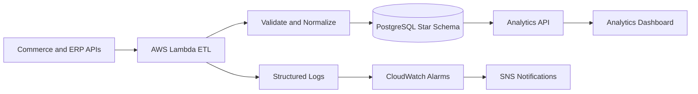

# E-commerce Analytics Data Platform

Full reconstruction of a production e-commerce analytics platform and data warehouse.

The legacy system had accumulated structural debt across data, backend, frontend, and automation: duplicate and orphaned records, weak security boundaries, large client-side aggregations, fragile pipelines, and low observability. The rebuild moved analytics computation closer to the database, cleaned historical data, and introduced incremental cloud pipelines with operational alerts.

**Period:** January-February 2026  
**Status:** Delivered to production  
**Role:** Sole architect and implementer

---

| Dimension | Before | After |
|---|---:|---:|
| Data quality score | 2/10 | 9/10 |
| Problematic records | 89,487 | 0 |
| p95 API latency | ~30s | <2s |
| Tables with RLS | Partial | 100% |
| Referential integrity | Weak | FK-backed |
| Observability | Reactive/manual | Cloud alarms |

---

## Case Study Files

- [Overview](overview.md) — context, audit findings, and solution strategy
- [Architecture](architecture.md) — migration strategy, star schema design, and cloud ETL
- [Technical Decisions](technical-decisions.md) — migration strategy, data modeling, infrastructure choices
- [Key Flows](key-flows.md) — migration flow, incremental sync, and incident handling
- [Representative Snippets](representative-snippets.md) — UPSERT patterns, RLS policies, circuit breaker
- [Reliability and Ops](reliability-and-ops.md) — alarms, MTTR, and operational response
- [Results](results.md) — quantified outcomes across data, application, and infrastructure layers

## Stack

Python, TypeScript, PostgreSQL, AWS Lambda, EventBridge, CloudWatch, SNS, Secrets Manager, Terraform.

## High-Level Flow

## Representative Pseudocode

See [representative-pseudocode.md](representative-pseudocode.md) for examples of incremental sync, deduplication, and database-first analytics.
