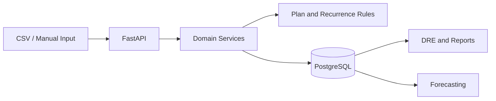

# Financial Management Platform

Financial management platform for operational control, DRE generation, recurring transactions, forecasting, imports, reporting, and tenant data boundaries.

The project replaces spreadsheet-driven financial workflows with a backend-centered system that keeps historical data consistent, prevents duplicated recurring transactions, supports partial import success, and enforces plan limits before data operations.

**Status:** Pre-launch / internal rollout  
**Role:** Backend, architecture, data model, and implementation

---

## What This System Does

- DRE generation from normalized financial records.
- Recurring transaction rules with versioning.
- Forecasting using historical behavior and trend signals.
- CSV import with row-level validation and partial success tracking.
- Plan-based feature limits.
- Tenant data isolation at the database layer.

## Engineering Focus

- Layered backend architecture: routers, services, repositories.
- Explicit domain rules for financial operations.
- Versioned recurring rules to preserve historical correctness.
- Database constraints and RLS-backed tenant isolation.
- Import pipeline that reports row-level success and failure.
- Report generation as a backend responsibility.

## Stack

Python, FastAPI, PostgreSQL, Pydantic, pandas, report generation, Next.js, Docker.

## High-Level Flow

## Representative Pseudocode

See [representative-pseudocode.md](representative-pseudocode.md) for recurring transaction versioning, import validation, and tenant-bound queries.
