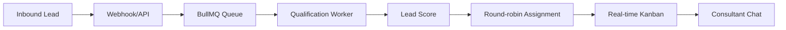

# Fintech Lead Qualification Platform

CRM and lead qualification platform for financing operations.

The system reduced manual lead triage by combining WhatsApp intake, AI-assisted qualification, automatic round-robin assignment, and a real-time Kanban/chat interface for consultants. The main engineering challenge was keeping lead intake responsive while AI classification, routing, and chat state ran asynchronously in the background.

**Status:** Delivered to production  
**Role:** Backend and integrations

---

## What This System Does

- Receives inbound leads from web and messaging channels.
- Runs a structured qualification flow over WhatsApp.
- Scores lead temperature and risk profile.
- Assigns qualified leads through round-robin distribution.
- Provides a real-time Kanban board for consultants.
- Keeps consultant chat and automated intake workflows separated.

## Engineering Focus

- Queue-based processing for webhook workloads.
- Rule-based fallback when LLM classification is unavailable.
- Idempotent lead assignment and state transitions.
- Real-time updates through WebSockets.
- Integration boundaries for messaging providers and internal CRM flows.

## Stack

Node.js, TypeScript, Fastify, PostgreSQL, Redis, BullMQ, WebSockets, React.

## High-Level Flow

## Representative Pseudocode

See [representative-pseudocode.md](representative-pseudocode.md) for async intake, fallback classification, and assignment logic.
