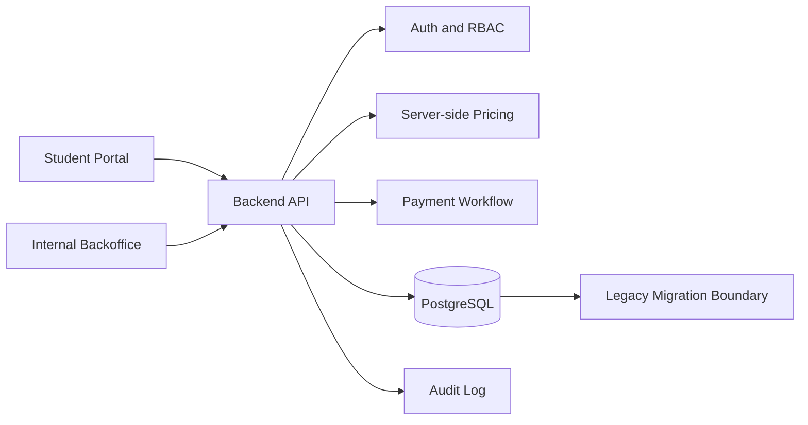

# Higher Education Enrollment Platform

Rebuild of a student enrollment and internal backoffice ecosystem for a higher education institution.

The project started after a technical audit found critical security, data-boundary, and maintainability issues in the legacy system: sensitive rules running in the browser, direct database access from frontend code, exposed credentials, weak permission boundaries, client-side data aggregation, and operational workflows that were difficult to evolve safely.

The new platform moved critical rules and state changes to a backend API, centralized authentication and authorization, introduced audit logs, made pricing and payment flows server-side, and supported a gradual production migration while the legacy system remained available during user adaptation.

**Status:** In production, with legacy system kept temporarily during adoption  
**Role:** Backend, data, architecture, deployment, code review, and technical coordination

---

## What This System Does

The platform supports the enrollment lifecycle from candidate registration to internal operational follow-up:

- Candidate registration and enrollment flow.
- Course, shift, pricing, voucher, and campaign rules.
- Document upload, review, approval, and rejection.
- Internal backoffice with enrollment tracking and operational workflows.
- Payment checkout and status tracking.
- Audit trail for relevant operational actions.
- Migration path from legacy operation to the new platform.

## Engineering Focus

- Server-side boundary for all critical writes and business rules.
- JWT-based authentication and permission checks in the API.
- RBAC for internal users and departments.
- Pricing calculated on the server, not in the browser.
- Audit logs for sensitive operational actions.
- PostgreSQL schema normalization and migration planning.
- Cloud deployment and operational observability.
- Gradual migration strategy to reduce production risk.

## Documentation Structure

- [Overview](overview.md) — context, scope, roles, and integrations
- [Architecture](architecture.md) — component boundaries, data flow, and deployment model
- [Key Flows](key-flows.md) — enrollment, documents, pricing, payment, and backoffice flows
- [Technical Decisions](technical-decisions.md) — trade-offs and architecture decisions
- [Reliability and Ops](reliability-and-ops.md) — operational behavior and failure handling
- [Security and Data Boundaries](security-and-data-boundaries.md) — authentication, authorization, data access, and secrets
- [Results and Measurement](results-and-measurement.md) — outcomes and measurement plan
- [Verification Checklist](verification-checklist.md) — evidence checklist for implementation review

## Stack

Node.js, TypeScript, NestJS, Next.js, PostgreSQL, Prisma, Docker, AWS infrastructure patterns.

## High-Level Flow

## Representative Pseudocode

See [representative-pseudocode.md](representative-pseudocode.md) for examples of the backend boundary, permission checks, pricing flow, and audit logging model.
