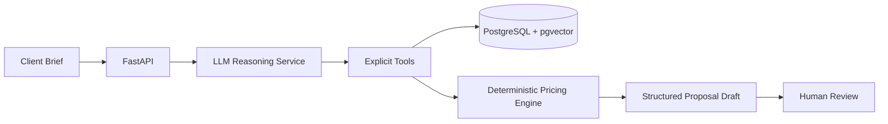

# Internal Proposal Agent

Internal agent for proposal drafting, technical scoping, and early sales engineering work.

The system helps transform a loose client brief into a structured proposal draft by retrieving context from past projects, reference architectures, team profiles, and pricing rules. It does not replace engineering judgment. It reduces the amount of repetitive discovery work before a human reviews scope, risks, architecture, and commercial assumptions.

**Status:** Homologation  
**Role:** Backend, architecture, data model, AI workflow, and implementation

---

## Why It Exists

Early proposal work usually depends on senior engineers stopping delivery work to answer the same questions repeatedly:

- What kind of architecture fits this scope?
- Have we delivered something similar before?
- Which team profile is realistic?
- What are the main uncertainty/risk factors?
- How should effort and price be estimated?

The agent centralizes that context and turns it into a first draft. The final decision remains human.

## Architecture

```text
User briefing
  -> API layer
  -> reasoning service with tool use
  -> knowledge retrieval over internal data
  -> deterministic pricing engine
  -> structured proposal draft
  -> human review
```

Core modules:

- **Intake**: captures the conversation and extracts structured scope fields.
- **Knowledge**: retrieves past projects, reference architectures, team profiles, and pricing rules.
- **Reasoning**: orchestrates the LLM with explicit tools and constrained outputs.
- **Pricing**: deterministic engine for effort, margin, risk buffer, and pricing ranges.
- **Persistence**: stores conversations, messages, project references, embeddings, and generated proposals.

## Key Technical Decisions

### RAG instead of fine-tuning

The company knowledge changes often: past projects, team composition, costs, reference architectures, and commercial strategy. RAG keeps that data editable and auditable without retraining a model.

### LLM reasoning separated from pricing

The LLM can help structure the problem, retrieve references, and explain trade-offs. It should not be the source of truth for price calculation. Pricing is handled by deterministic code with explicit inputs, versioned rules, and auditable output.

### PostgreSQL as relational and vector store

The same database stores operational records and embeddings. This keeps the architecture smaller, avoids an extra vector database at the current scale, and makes the system easier to operate.

### Human-in-the-loop by default

The output is a draft, not an automatic proposal. The system is designed to reduce blank-page work and standardize reasoning, not to bypass review.

## Data Model Highlights

- `team_members`: internal delivery capacity and cost assumptions.
- `cost_rules`: active pricing configuration and margin assumptions.
- `complexity_multipliers`: risk and complexity factors used by the pricing engine.
- `past_projects`: anonymized delivery history used for reference.
- `project_embeddings`: vector representation of past project context.
- `reference_architectures`: reusable solution patterns.
- `reference_architecture_embeddings`: semantic retrieval over architecture references.
- `conversations` and `messages`: persisted interaction history.

## Reliability and Safety

- Critical calculations are deterministic and testable.
- Retrieval context is constrained to internal sources.
- Pricing rules are versioned to preserve proposal history.
- LLM output is treated as assistance, not source of truth.
- Human review remains part of the workflow before client-facing use.

## Stack

Python, FastAPI, PostgreSQL, pgvector, Pydantic, LLM APIs, Next.js.

## High-Level Flow



## Representative Pseudocode

See [representative-pseudocode.md](representative-pseudocode.md) for examples of tool execution, RAG retrieval, and deterministic pricing boundaries.
